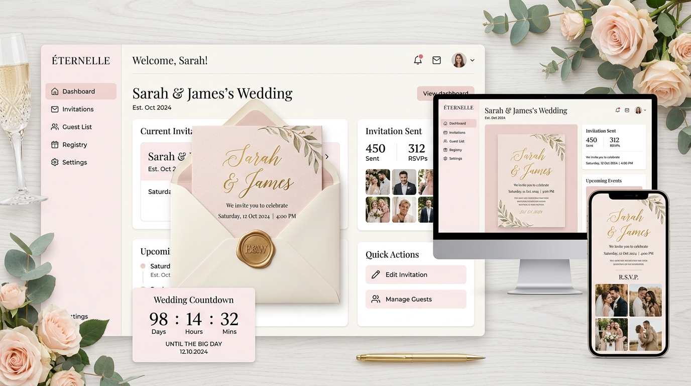
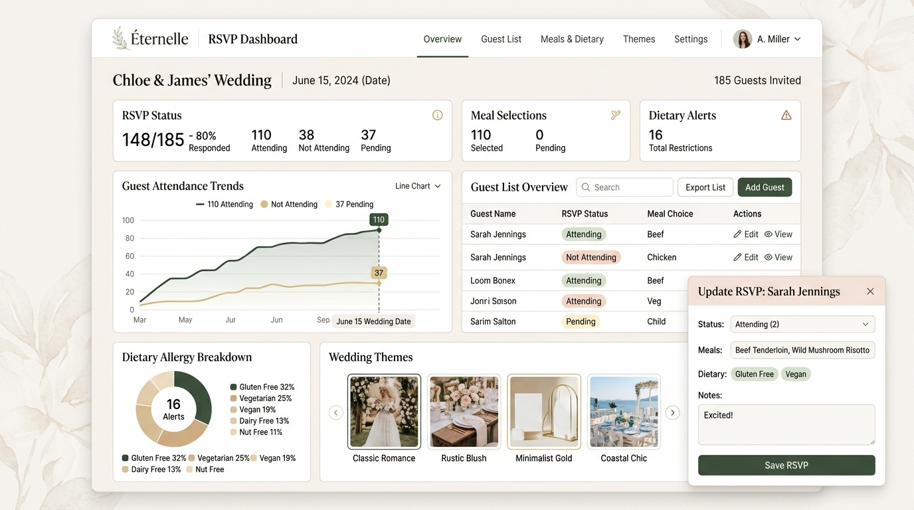

<div align="center">

# 🏰 Éternelle — Luxury Digital Wedding Invitations & Micro-Sites SaaS

<p align="center">
  <strong>The Digital Wedding Invitation That Feels Like Fine Paper Stationery.</strong><br>
  Interactive 3D wax seal reveals, live countdowns, Google Maps itineraries, and real-time RSVP & dietary headcount sync.
</p>

<p align="center">
  
  
  
  
  
  
</p>

---



</div>

## ✨ Why Éternelle?

Traditional paper stationery costs **\$800+**, takes weeks to print, and gets lost in the mail. Static PDF links and Canva templates feel clunky and lack real-time guest tracking.

**Éternelle** bridges tactile old-money luxury with modern web technology:
- **Guests** crack open a realistic 3D wax seal with sound effects and soothing harp music, view the schedule with 1-tap Google Maps directions, and submit RSVPs with meal choices in under 45 seconds.
- **Couples** manage their headcount, dietary alerts, and accommodations in real-time, exporting a 1-click catering spreadsheet for their venue.
- **Planners & Studios** commercialize custom bespoke suites for multiple clients.

---

## 🚀 Key Features

### 💌 1. Interactive 3D Guest Unboxing (`/invite/:slug`)
- **Realistic Wax Seal Crack**: Physics-based wax seal cracking animation, sound effects, and floating confetti.
- **Background Audio**: Built-in ambient harp and classical piano synthesizer tracks.
- **Logistics Cards**: Day-of timeline with icons (Ceremony, Cocktail Hour, Dinner, Dance) and 1-tap Google Maps directions.
- **Hotel & Accommodations**: Room blocks, group promo codes, and direct booking links.
- **Love Story Gallery**: Photo albums with captions and relationship milestones.

### 📊 2. Real-Time RSVP & Catering Command
- **1-Tap Guest Submissions**: Guests submit attendance (*Joyfully Accepts* / *Regretfully Declines*), meal choices, plus-ones, and dietary restrictions.
- **Live Database Sync**: Submissions automatically store in PostgreSQL and reflect in the couple's dashboard instantly.
- **1-Click CSV / Excel Export**: Generate a formatted catering report with exact meal counts (e.g. *42 Prime Beef Tenderloin, 28 King Salmon, 14 Truffle Risotto*) and allergy warnings.

<div align="center">
  
</div>

### 🧙‍♂️ 3. 4-Step Free Onboarding Wizard
- **Step 1**: Couple Names & automated monogram seal generator (*Scarlett & Julian* $\rightarrow$ *S&J*).
- **Step 2**: Aesthetic palette selection with dynamic live card preview.
- **Step 3**: Event date, venue address, and city location.
- **Step 4**: Custom link claiming (`.../invite/scarlett-julian`) + instant free account registration and database persistence.

### 🎨 4. Curated Designer Suites
Six bespoke Kinfolk and Vogue-inspired aesthetic colorways:
- 🌿 **Olive & Burgundy Romance**: Classic vineyard botanical with deep burgundy wax seal.
- 🥂 **Champagne & Noir Luxury**: Old-money editorial chic with obsidian cards and champagne foil.
- 🏛️ **Tuscan Sun Terracotta**: Warm Italian countryside villa with burnt sienna and olive tones.
- 🌹 **Dusty Rose & French Mauve**: Chateau garden romance with delicate calligraphy.
- 🍃 **Imperial Emerald & Gold**: Conservatory greenery with gold leaf typography.
- 🌸 **Rose Gold Blush**: Contemporary minimalism with soft blush and shimmering rose gold.

### 📸 5. Save-the-Date & Social Media Studio
- **Pinterest Pins**: Auto-generated 2:3 vertical pins with rich aesthetic tags.
- **Instagram Stories**: Auto-generated 9:16 vertical stories with countdowns and couple photography.
- **WhatsApp Luxury Formatted Text**: 1-click copyable message for texting guests directly.

### 👑 6. Secret Master Admin Portal (`Fox@967777`)
- **Hidden Security Route**: Accessible only via `/admin` (hidden from all public menus).
- **Protected by Master Key**: `Fox@967777`.
- **Live Metrics**: Gross Revenue ($), Paid Conversion Rate (%), Total Registered Couples, and Total RSVPs.
- **License Authority**: 1-click button to grant **Lifetime Creator** or **Pro Pass** to any user.

---

## 🛠️ Tech Stack & Architecture

```
├── client/ (React + TypeScript + Vite)
│   ├── src/components/
│   │   ├── admin/         # Master Admin Command Panel
│   │   ├── auth/          # Login & Registration Modals
│   │   ├── billing/       # Gumroad Checkout Integration
│   │   ├── dashboard/     # Couple's Creator Studio & RSVP Manager
│   │   ├── guest/         # 3D Envelope Experience & RSVP Modal
│   │   ├── landing/       # High-Contrast Editorial Landing Page
│   │   ├── onboarding/    # 4-Step Free Onboarding Wizard
│   │   └── studio/        # Pinterest & Instagram Social Studio
│   └── src/utils/api.ts   # REST API client with offline fallback
│
├── server/ (Node.js + Express 5)
│   ├── routes/
│   │   ├── admin.js       # Secret SuperAdmin KPI routes
│   │   ├── auth.js        # JWT token generation & bcrypt hashing
│   │   ├── rsvps.js       # Guest RSVP submission & retrieval
│   │   └── weddings.js    # Couple suite data sync & public slug lookup
│   ├── db.js              # PostgreSQL connection pool with memory fallback
│   ├── schema.sql         # Relational database schema
│   └── index.js           # Server entry point & static SPA serving
│
└── render.yaml            # Render Blueprint for 1-click full-stack deployment
```

---

## 🚀 Getting Started Locally

### Prerequisites
- Node.js 18+ installed
- Git installed
- (Optional) PostgreSQL installed locally, or run with automatic in-memory fallback!

### 1. Clone the repository
```bash
git clone https://github.com/memanmeetraj001-ctrl/eternelle-wedding-invites.git
cd eternelle-wedding-invites
```

### 2. Install dependencies
```bash
npm install
```

### 3. Start Development Server
```bash
# Frontend dev server
npm run dev

# Or start the full Express server
npm start
```
Open `http://localhost:5173` or `http://localhost:3000` in your browser.

---

## ☁️ 1-Click Deployment via Render Blueprint

This repository includes a production-ready **Render Blueprint (`render.yaml`)** that automatically provisions both the Node web service and the managed PostgreSQL database:

1. Open your [Render Dashboard](https://dashboard.render.com/).
2. Click **New +** in the top right $\rightarrow$ select **Blueprint**.
3. Connect your repository: `memanmeetraj001-ctrl/eternelle-wedding-invites`.
4. Render will read `render.yaml` and configure:
   - **Database**: `eternelle-db` (PostgreSQL)
   - **Web Service**: `eternelle-wedding-saas` (Node.js / Express)
5. Click **Apply**. Render will automatically build, link `DATABASE_URL`, and deploy your live full-stack SaaS!

---

## 💳 Monetization & Gumroad Tiers

| Tier | Price | Highlights |
| :--- | :--- | :--- |
| **Free Starter** | **\$0** | 1 Event, Up to 20 guest RSVPs, Standard 3D envelope. |
| **Pro Wedding Pass** | **\$19** *(One-time)* | Unlimited RSVPs, Custom audio tracks, 1-click CSV catering export. |
| **Lifetime Creator** | **\$79** *(One-time)* | Unlimited events, Commercial client rights, White-labeling for planners. |

---

## 🔒 Security & Master Admin Access

- **Public Site**: Standard visitor experience with 0 visible admin links.
- **Admin Direct URL**: Navigate to `/admin` or `?view=admin`.
- **Passkey**: `Fox@967777`.

---

## 📄 License & Credits

Built with ❤️ by the **Éternelle Engineering Team**.  
All rights reserved © 2026 Éternelle Luxury Technologies.
